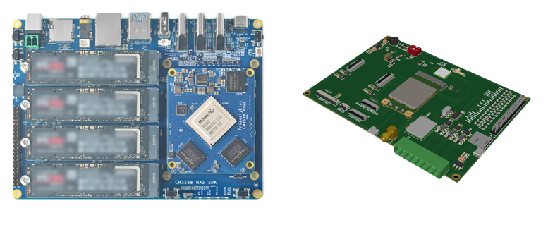

# STM32G431 NASE Board

  
  
<em>Demo Board</em>

## Overview
Testing Sample A2 Board for Slave & Master Traffic Controller

## Software Development Target
1) SRAM Backup Flash Memory for Application Fallback and Update
2) Bootloader Firmware Upgrade via Ethernet Port
3) MicroROS(Slave) communication with ROS-Agent (Master) via Ethernet
4) CANFD Radar Data Acquisition & Forwarding to ROS-Agent via Ethernet
5) Offline microUSB firmware upgrade
6) RTC Time Base Event Trigger
